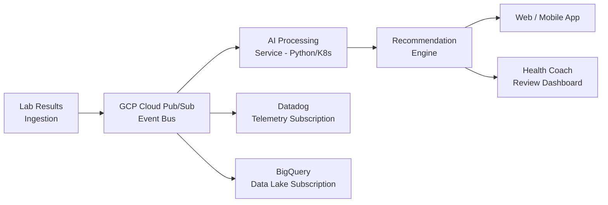
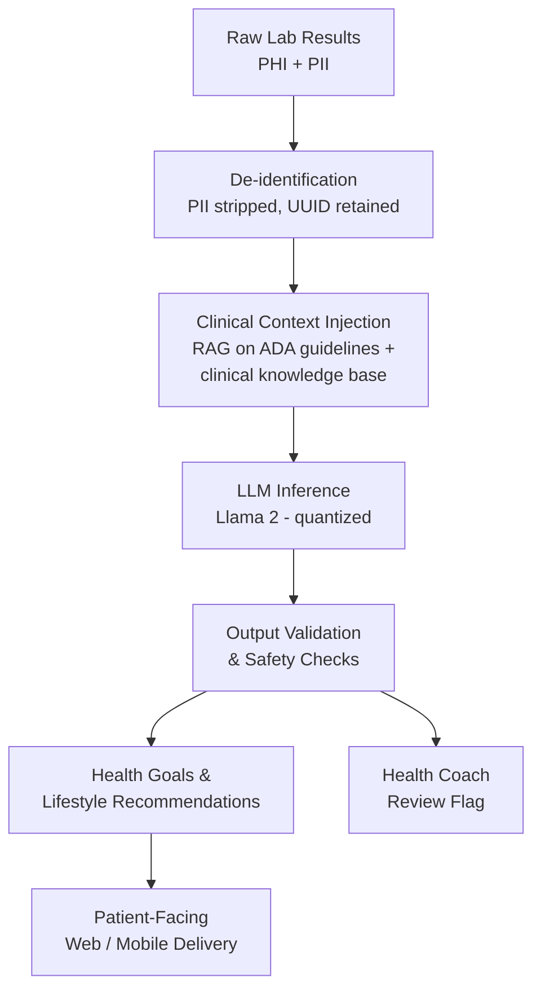
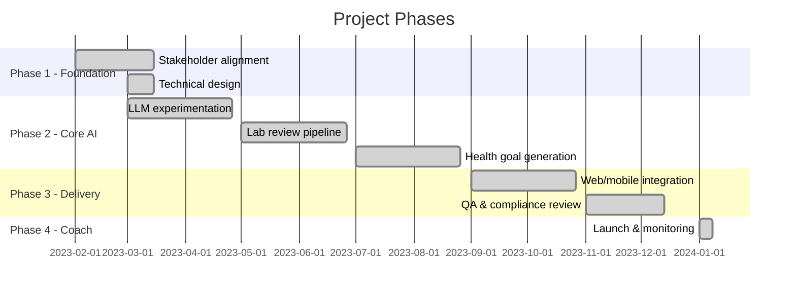
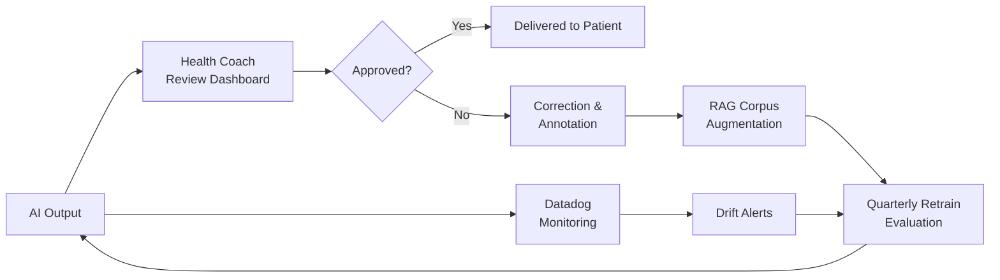

# Case Study: AI-Powered Lab Review & Lifestyle Recommendations

---

## TLDR;

- **Problem:** Health coaches were spending ~45 minutes per patient manually reviewing lab results and writing individualized lifestyle recommendations — a process that couldn't scale with patient volume growth.
- **Approach:** Built a self-hosted AI pipeline using Llama 2 with Retrieval-Augmented Generation (RAG) on clinical guidelines to automate lab review and recommendation generation, as a microservice integrated into the existing web and mobile platform.
- **Key Technology:** GCP (GKE, Cloud Pub/Sub, BigQuery), Llama 2 (Meta), HuggingFace `transformers` + `bitsandbytes`, Python, Docker, Kubernetes, Terraform, Datadog.
- **Team:** 3 engineers, 1 QA — supported by clinical, compliance, DevOps, and product stakeholders.
- **Outcome:** Achieved 400%+ throughput improvement over manual health coach reviews; 87% of AI-generated recommendations approved without modification during the MVP-stage.

---

## Background & Problem

The organization's health coaching team faced a capacity bottleneck: as patient volume grew, the manual process of reviewing lab results and crafting individualized lifestyle recommendations couldn't scale. Each review required a clinician to interpret results against clinical guidelines and produce written health goals — a process averaging 45 minutes per patient. This initiative set out to automate that workflow using a self-hosted large language model, enabling the clinical team to shift from routine data processing to exception review and continuous model improvement.

---

## High-Level Goals

- Reduce clinical hours spent evaluating lab results to produce lifestyle recommendations
- Utilize AI to review lab results against established clinical guidelines
- Utilize AI to produce personalized health goals and lifestyle recommendations
- Integrate results into the existing web and mobile application
- Create a virtual health coach to assist patients with questions about their recommendations

---

## Stakeholder Planning

Cross-functional alignment was established early to ensure shared understanding of the problem, constraints, and success criteria.

- Collaborated with senior leadership, clinical stakeholders, and the product team to:
  - Understand the business challenges and capacity constraints
  - Discuss and quantify target outcomes
  - Conduct discovery sessions and event storming workshops to map the patient and coach workflows, producing domain models and context maps
- Advised stakeholders on AI capabilities, limitations, and realistic timelines
- Coordinated with the data team to define how lab results and recommendation data would be shared across systems
- Partnered with the compliance team to establish how HIPAA and HITRUST requirements would be met throughout the design and build

---

## Product Planning & Success Metrics

Worked with the product team to co-define measurable success criteria and a governance model tied to business KPIs.

- Co-defined success metrics, anchored on a target of **400% throughput improvement** compared to the manual health coach review process (baseline: reviews per coach per day)
- Produced a long-term roadmap and governance model across four delivery phases, with defined phase gates tied to clinical accuracy, performance, and compliance benchmarks
- Authored a PRD (Product Requirements Document) with the product team, reviewed and approved by stakeholders
- Established data-driven dashboards for leadership to track volume, accuracy approval rates, and system uptime in real time

---

## Technical Design

Designed a secure, scalable AI pipeline anchored in clinical guidelines and built for auditability and continuous improvement.

- Evaluated available LLM technologies and self-hosting strategies; produced a technology-readiness matrix comparing proprietary API-based models against self-hosted open-source alternatives
- Selected **Llama 2** as the foundation model — the most capable openly licensed model available at project inception, enabling fully self-hosted inference to meet HIPAA data residency requirements
- Built the LLM service in **Python** using HuggingFace `transformers` for inference, `bitsandbytes` for 4-bit quantization 
- Implemented **Retrieval-Augmented Generation (RAG)** to ground recommendations in clinical evidence:
  - Primary source: AMA (American Medial Association) clinical standards
  - Supplementary source: proprietary clinical knowledge base curated by the organization's clinical team
- Authored a Technical Design Document (TDD) establishing architectural guidelines, service contracts, and integration patterns for the engineering department
- Ensured the architecture included:
  - Telemetry and observability hooks (Datadog) to measure output volume, latency, and uptime
  - Full access to LLM input/output streams for the data team (via BigQuery)
  - A health coach review dashboard for ongoing quality review and model augmentation
  - Leadership dashboards surfacing recommendation volume, approval rates, and performance SLAs
  - Security-first design: PHI (diagnoses, clinical conditions) and PII (name, date of birth, contact data) stored in separate datastores, linked only via an internal UUID — no identifiable patient data was ever transmitted to the LLM
- Reviewed architecture and signoff obtained from the CTO

---

## System Architecture

The system was designed around an event-sourcing pattern to decouple producers from consumers, enabling independent scaling and extensibility across the platform.

### Why This Architecture

**Event sourcing with GCP Cloud Pub/Sub** was chosen for three reasons:

1. **Fan-out without coupling** — multiple downstream consumers (telemetry, data lake, health coach queue) subscribe independently to the same event stream. Adding a new consumer requires no changes to upstream services.
2. **Auditability and replay** — every lab result ingestion event is durably recorded. Events can be replayed for debugging, reprocessing with an updated model, or retroactive analysis without re-ingesting from the source system.
3. **Operational resilience** — Pub/Sub's at-least-once delivery and dead-letter queue support mean no events are silently dropped; failures surface and can be retried without data loss.

Containerized deployment on GKE was chosen to support horizontal scaling during peak lab result volumes and to provide environment consistency across development, staging, and production.

---

## AI Pipeline

Each lab result followed a structured processing path designed to enforce data privacy and clinical accuracy at every step.

- **De-identification:** PII was stripped at the pipeline boundary; only anonymized health metrics and lab values were passed to the LLM, referenced by UUID
- **RAG context injection:** Relevant clinical guidelines were retrieved dynamically based on the lab markers present, ensuring recommendations were evidence-grounded rather than purely generative
- **Output validation:** Responses were evaluated for completeness, clinical safety thresholds, and format compliance before delivery; flagged outputs were routed to the health coach review queue
- **Continuous improvement:** Approved corrections from health coach review were added back to the RAG context corpus, incrementally improving recommendation quality over time

---

## Roadmap & Phasing

The project was delivered in four phases, with phase gates requiring clinical accuracy and compliance validation before progression.

- Collaborated with the product team to break the delivery into phases with clear milestones and acceptance criteria
- Facilitated epic and sprint planning across all four phases
- Phase gates required sign-off from clinical and compliance stakeholders before each advancement

---

## Development Execution

A small, focused team delivered a production-grade AI system by prioritizing event-driven scalability and continuous feedback loops from day one.

- Architected for scale from the outset — every design decision was evaluated against future patient volume growth, using the event-sourcing pattern as the backbone to ensure extensibility without re-architecture
- Implemented event sourcing on **GCP Cloud Pub/Sub** with dedicated subscriptions:
  - Datadog telemetry subscription for real-time performance and error monitoring
  - BigQuery subscription for data lake ingestion, enabling downstream analytics and model evaluation
- All services deployed as containerized workloads (Docker) on GKE, with Helm charts managing configuration across environments
- Built an internal **health coach review dashboard** enabling clinical staff to:
  - Review LLM prompt/response pairs in a structured interface
  - Annotate corrections and improved responses
  - Promote accepted corrections back into the RAG context to improve future recommendations without a full model retrain
- Team composition: 3 engineers (AI service, platform, and integrations), 1 QA; DevOps infrastructure delegated to the DevOps team under joint design

---

## Deployment

Infrastructure was designed for compliance, fault tolerance, and repeatable deployments across environments.

- Designed the GCP infrastructure in collaboration with the DevOps team, targeting HIPAA-compliant architecture on GCP:
  - **GKE** (Google Kubernetes Engine) for containerized AI service workloads with horizontal pod autoscaling
  - **Postgresql** Relational database
  - **Cloud Pub/Sub** for durable, scalable event streaming
  - **BigQuery** as the data lake for recommendation input/output storage and analytics
  - **Cloud Storage** for model artifact versioning and RAG corpus storage
  - **Secret Manager** for secure storage of API keys, database credentials, and model configuration
- Ensured all GCP services were configured within a VPC with private service access — no workload exposed to the public internet
- HIPAA compliance validated via: VPC Service Controls, CMEK (Customer-Managed Encryption Keys) on BigQuery and Cloud Storage, audit logging enabled across all data-plane services
- Kubernetes and Helm charts designed to support environment parity (dev/staging/prod) and one-command rollback
- Terraform used for all infrastructure-as-code, enabling reproducible, auditable deployments
- CI/CD pipeline automated build, test, container image push, and Helm-based deployment on merge to main

---

## Virtual Health Coach

Extended the core recommendation engine into a conversational interface, enabling patients to ask follow-up questions about their health goals and lab results.

- Built on the same self-hosted Llama 2 stack (HuggingFace `transformers`, 4-bit quantization via `bitsandbytes`), enabling consistent recommendation context across both the batch pipeline and the interactive coach
- Implemented a multi-turn conversational layer in Python, maintaining session context so patients could ask follow-up questions referencing prior messages (e.g., "Why do I need to reduce sodium?" following a dietary recommendation)
- RAG retrieval scoped to the patient's specific recommendation set and relevant ADA guideline excerpts — the coach answered questions grounded in the patient's own data and clinical evidence, not generic health information
- Integrated into the existing web and mobile application as a chat interface
- Health coach review dashboard extended to cover virtual coach sessions, enabling clinical staff to flag and correct low-confidence or out-of-scope responses

---

## Results & Outcomes

> *Note: Specific figures below are representative. Exact values are subject to NDA.*

The platform delivered measurable improvements to clinical capacity and patient engagement within the first six months of production operation.

- **400%+ throughput improvement** — health coach review capacity increased from approximately 10 patient reviews per coach per day to 50+, measured against the pre-launch manual review baseline
- **Turnaround time** reduced from ~45 minutes per patient (manual) to under 5 minutes (AI-assisted pipeline)
- **87% approval rate** — the proportion of AI-generated recommendations approved by health coaches without modification, measured in the first quarter post-launch, demonstrating strong alignment with clinical standards
- **99.3% uptime** maintained across all production services over the MVP period
- Clinical staff shifted from routine data processing to exception review and model improvement, increasing job satisfaction and reducing burnout reported in team retrospectives

---

## Lifecycle & Support

A continuous improvement model was established to ensure the system remained accurate, compliant, and performant over time.

- **Model monitoring:** Datadog dashboards tracked recommendation volume, latency, error rates, and approval rate trends; threshold-based alerts triggered investigation when approval rates dropped below baseline
- **Drift detection:** Weekly statistical reviews of approval rates and health coach correction patterns identified distribution shifts in lab result inputs or degradation in recommendation quality
- **Feedback and retraining cadence:** Health coach corrections were accumulated in the RAG context corpus on a rolling basis; full model evaluation and potential fine-tuning cycles were scheduled quarterly, with ad-hoc retraining triggered by sustained drift alerts
- **Rollback and versioning:** Model artifacts and RAG corpus snapshots versioned in Cloud Storage; Helm chart rollback enabled same-day reversion to a prior model version if a new release caused approval rate regression
- **SLA and incident response:** 99.3% uptime SLA with defined P0/P1 incident response procedures; Datadog alerts routed to on-call rotation with automated runbooks for common failure modes
- **Data retention:** Lab result event data retained in BigQuery for 7 years per HIPAA retention requirements; PII stored in a separate, independently access-controlled datastore with automated purge on patient data deletion requests

